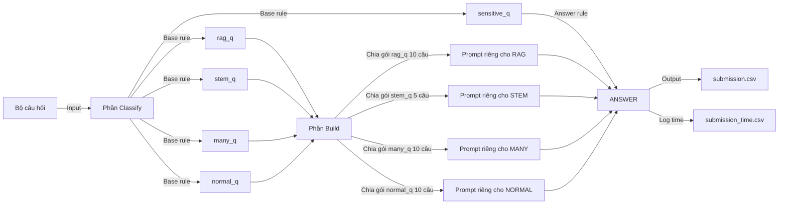

# VNPT HACKATHON 2025 – Track 2: The Builder

## Mô tả
Repository này chứa giải pháp tham gia **VNPT Blockchain & AI Hackathon 2025 – Track 2 (The Builder)**.  
Hệ thống thực hiện suy luận và trả lời câu hỏi trắc nghiệm bằng cách gọi **VNPT LLM API**, sau đó xuất kết quả theo đúng định dạng BTC yêu cầu.

---

## Pipeline Flow
- Phân loại câu hỏi thành các nhóm: **Sensitive,Normal, Many choices, RAG, STEM**.
+ Sensitive: là những câu hỏi nhạy cảm liên quan đến chống phá chính quyền và phạm tội.
+ RAG: là những câu hỏi chứa các đoạn thông tin rất dài
+ STEM: là những câu hỏi về Toán, Lý, Hóa, Kinh tế, Tài chính, Định lượng, Suy luận.
+ Many choices: những câu hỏi có nhiều hơn 4 đáp án(tránh nhầm lẫn giúp cái câu hỏi normal có thể trả lời nhanh hơn).
+ Normal: những câu hỏi còn lại.
- Xử lý theo các gói câu hỏi thay vì chỉ 1 câu mỗi để tối ưu số lần gọi API, thời gian trả lời.
- Sử dụng prompt chuyên biệt cho từng loại câu hỏi(cân đối giữa độ chính xác và thời gian).
- Sơ đồ Pipeline.


---

## Cách chạy dự án

Dự án được đóng gói sẵn dưới dạng Docker image. Bạn **không cần cài Python hay thư viện** trên máy host.

---

### 1️⃣ Tải Docker image

```bash
docker pull kay0911/nta-vnpt-hackathon-track2
```

---

### 2️⃣ Chuẩn bị dữ liệu đầu vào

* Đặt file **`private_test.json`** và **api-keys.json** vào một thư mục bất kỳ trên máy
* Mở terminal (hoặc CMD / PowerShell) **tại thư mục chứa file này**

---

### 3️⃣ Chạy container (mount dữ liệu đầu vào)

#### 🔹 Linux / macOS (Terminal)

```bash
docker run -v $(pwd)/private_test.json:/code/private_test.json -v ${pwd}\api-keys.json:/code/api-keys.json -v $(pwd):/output kay0911/nta-vnpt-hackathon-track2
```

#### 🔹 Windows (CMD)

```cmd
docker run -v %cd%\private_test.json:/code/private_test.json -v %cd%:\api-keys.json:/code/api-keys.json -v %cd%:/output kay0911/nta-vnpt-hackathon-track2
```

#### 🔹 Windows (PowerShell)

```powershell
docker run -v ${PWD}\private_test.json:/data/private_test.json -v ${PWD}\api-keys.json:/code/api-keys.json -v ${PWD}:/output kay0911/nta-vnpt-hackathon-track2
```

---

### 4️⃣ Nhận kết quả đầu ra

Sau khi container chạy xong, trong **thư mục hiện tại trên máy** sẽ xuất hiện:

* `submission.csv`
* `submission_time.csv`

---

*Developed by **NTA Team***  
📩 khanh091103@gmail.com


